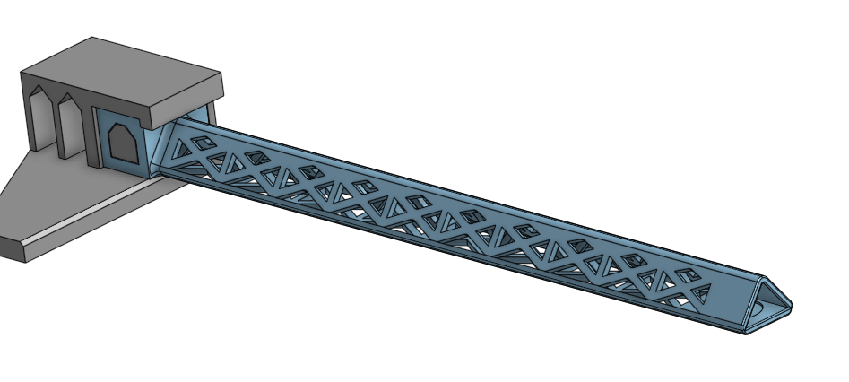
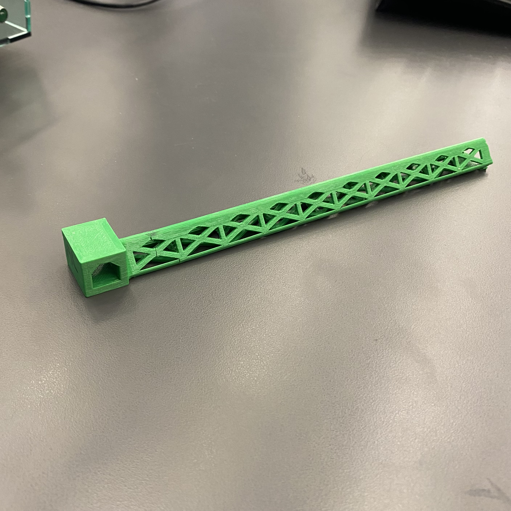
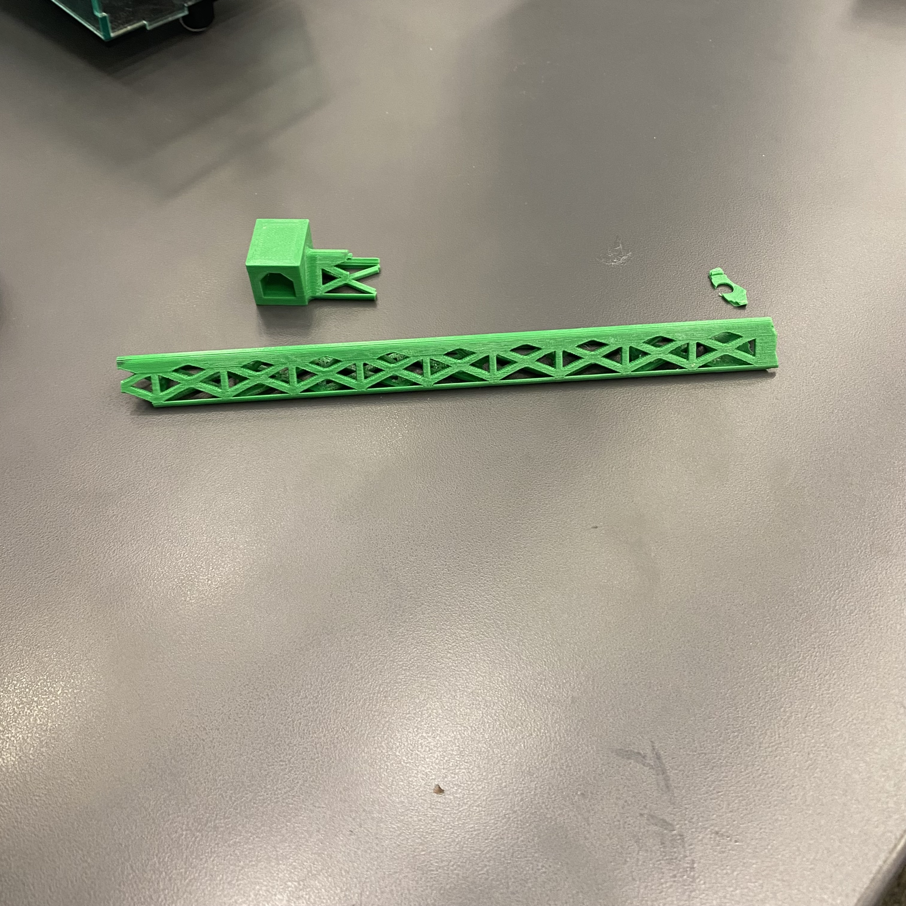
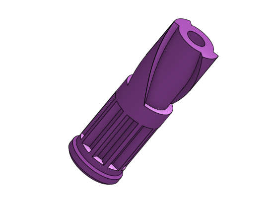
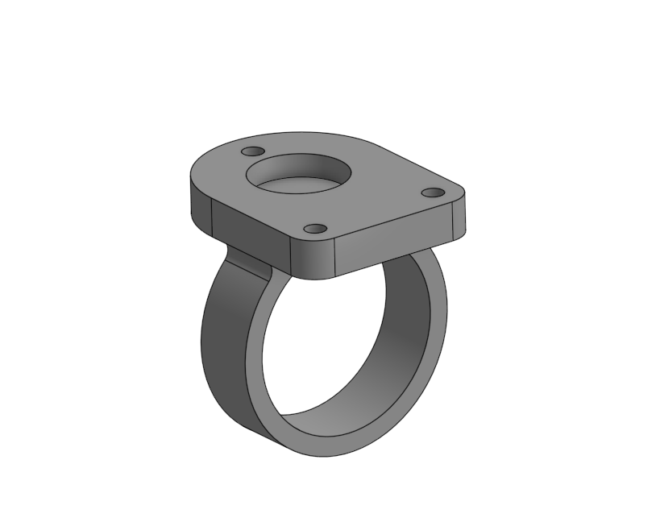
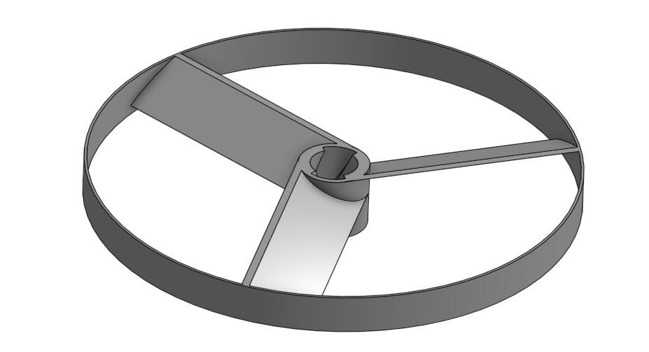
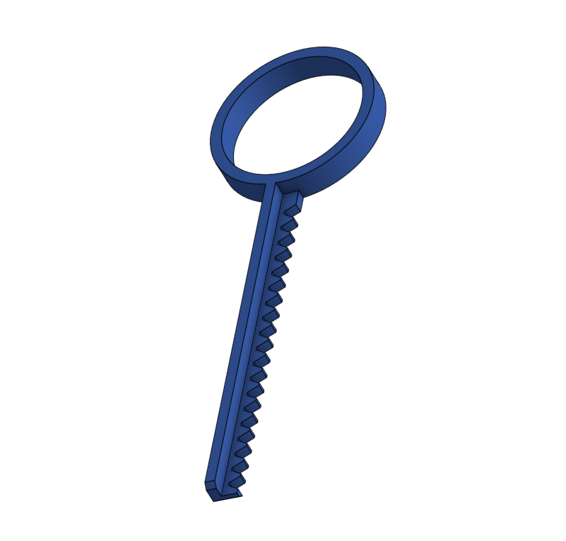
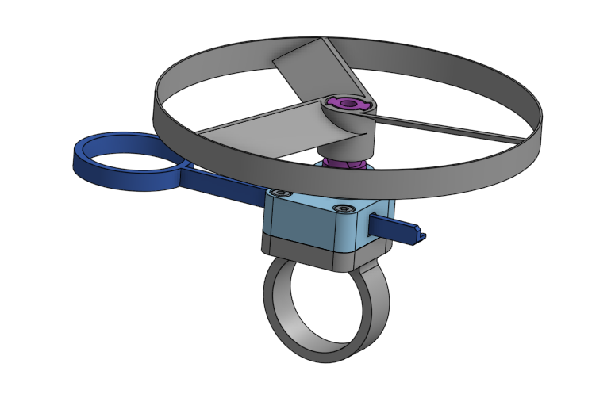

# Engineering_4_Notebook

&nbsp;

## Table of Contents

### Q1
* [LaunchPad1](#LaunchPad1)
* [LaunchPad2](#LaunchPad2)
* [LaunchPad3](#LaunchPad3)
* [LaunchPad4](#LaunchPad4)
* [CrashAvoidance1](#CrashAvoidance1)
* [CrashAvoidance2](#CrashAvoidance2)
* [CrashAvoidance3](#CrashAvoidance3)
* [LandingArea1](#LandingArea1)
* [LandingArea2](#LandingArea2)
* [MorseCode1](#MorseCode1)
* [MorseCode2](#MorseCode2)

### Q3
* [Beam_Design_Parts 1-3](#Beam_Design)
* [Onshape Collaboration_Part 1](#Onshape_Collaboration_Part_1)
* [Onshape Collaboration_Part 2](#Onshape_Collaboration_Part_2)
* [Onshape Collaboration_Part 3](#Onshape_Collaboration_Part_3)

&nbsp;

## LaunchPad1

### Assignment Description

This assignment was to code the serial monitor to count down from 10 to 0, with one second in between. It prints "Liftoff!" after landing.

### Evidence 

 

### Wiring

N.A.

### Code
[Part 1 code](https://github.com/afriedm49/Engineering4_Notebook/blob/main/raspberry-pi/Astronaut1.py)

### Reflection

It was challenging at first to figure out the for loop, but easy once I got it. It important to make sure that your step is negative if you are trying to count down, or else you will need to do print(10-x) for each value of x from 0 to 10. Generally, for loops are helpful for looping that is limited by a certain number of repetitions.
&nbsp;

## LaunchPad2

### Assignment Description

This assignment was to add on to part 1 by plugging in an external red LED which blinks as time goes down, and a green LED which stays on during liftoff.

### Evidence 

 

### Wiring

 

### Code
[Part 2 code](https://github.com/afriedm49/Engineering4_Notebook/blob/main/raspberry-pi/Astronaut2.py)

### Reflection

Make sure you are using OUTPUT on your LED direction. This will allow you to turn the LED on and off within the for loop, so it continually repeats. Make sure you match each LED pin with the correct pin in your code.

&nbsp;

## LaunchPad3

### Assignment Description

This assignment was to add on to parts 1 and 2 by connecting a button that starts the program.

### Evidence 

 

### Wiring

 

### Code
[Part 3 code](https://github.com/afriedm49/Engineering4_Notebook/blob/main/raspberry-pi/Astronaut3.py)

### Reflection

The tricky part on this assignment was making sure that the wiring was set up correct. It was much simpler than I originally thought, because the button only needed to be plugged in to 3V and an input PIN. Pressing the button closes the circuit, signalling a True button.value

&nbsp;

## LaunchPad4

### Assignment Description

This assignment was to add on to parts 1, 2, and 3 by connecting a servo that spins before liftoff. It starts spinning at 3 seconds remaining, by 60 degrees, and 60 degrees more for seconds 2 and 1, until it's turned all the way 180 degrees.
### Evidence 

 

### Wiring

 

### Code
[Part 4 code](https://github.com/afriedm49/Engineering4_Notebook/blob/main/raspberry-pi/Astronaut4.py)

### Reflection

#### In order to create a "sweeping" effect, it is important to set a counter before the program begins:
```python
counter = 0
```

#### Each second within the for loop, the counter adds one, and sweep begins after 7 seconds:
```python
counter += 1 
if counter > 7: 
    servo1.angle += 60 
```
&nbsp;

## CrashAvoidance1

### Assignment Description

This assignment is to set up the wiring and simple programming of an accelerometer, the mpu6050.

### Evidence 

 

### Wiring

 

### Code
[Crash Avoidance Code Part 1](https://github.com/afriedm49/Engineering4_Notebook/blob/main/raspberry-pi/CrashAvoidance1.py)

### Reflection

The wiring was the trickier part of this assignment. Make sure that the scl pin is connected to an scl applicable pin on the pico, and same with the sda pin. Also, make sure that you have a while loop printing the acceleration, and a time.sleep in place so the values don't run forever. 

As the output is a tuple, you are able to print only the x acceleration, for example, by typing print(mpu.acceleration[0]). Use [1] for y values and [2] for z values.

## CrashAvoidance2

### Assignment Description

This assignment is to make an LED turn on when the accelerometer is sideways.

### Evidence 

 

### Wiring

 

### Code
[Crash Avoidance Code Part 2](https://github.com/afriedm49/Engineering4_Notebook/blob/main/raspberry-pi/CrashAvoidance2.py)

### Reflection

Remember, because the output is a tuple, you are able to print only the x acceleration, for example, by typing print(mpu.acceleration[0]). Use [1] for y values and [2] for z values.
In order to complete this assignment, simply make the led turn on when mpu.acceleration[2] is equal to 0. Because it is hard to line it up exactly sideways, use a margin of error such as one shown below:

```python
while True:
    print(mpu.acceleration)
    if (-1 < mpu.acceleration[2] < 1):
        led.value = True
    else:
        led.value = False
```
&nbsp;

## CrashAvoidance3

### Assignment Description

This assignment is to initiate an LCD screen, printing velocity values of x, y, and z, as well as a title "ANGULAR VELOCITY" at the top of the screen

### Evidence 

 

### Wiring

 

### Code
[Crash Avoidance Code Part 3](https://github.com/afriedm49/Engineering4_Notebook/blob/main/raspberry-pi/CrashAvoidance3.py)

### Reflection

This code was tricky to navigate at first - I had trouble connecting two I2C devices on the same port. I was missing the line:
```python
 mpu = adafruit_mpu6050.MPU6050(i2c, address=your-address-here)
```
After adding this, then tweaking a couple other lines, I was able to turn the LCD screen on.

Now, for the simpler part. Set variables as lines of text you want to print, put that text in the label format setting the position with x= and y=, and then append the label. For example:
```python
 xvelocity = "X-velocity: " + str(round(mpu.gyro[0], 3))
 xlabel = label.Label(terminalio.FONT, text= xvelocity, color=0xFFFF00, x=5 , y=20)
 splash.append(xlabel)
```
Repeat with Y and Z values on subsequent lines, and you're done!
&nbsp;

## LandingArea1

### Assignment Description

This assignment was to design code that requests an input of 3 (x, y) coordinates, and then outputs the area of those points in a triangle.

### Evidence 

 

### Wiring

N.A.

### Code
[LandingArea code part 1](https://github.com/afriedm49/Engineering4_Notebook/blob/main/raspberry-pi/LandingArea1.py)

### Reflection

The main thing needed in order to code this is the split() function. This allows for user input of 2 separate variables within the same input line. Putting a comma in parentheses will designate it as the separator for the input, meaning a user will have to separate their input with a comma as well.

&nbsp;

## LandingArea2

### Assignment Description

This assignment was to design code that requests an input of 3 (x, y) coordinates, similarly to part 1, and then outputs the triangle of those points on the OLED screen, with a centerpoint and an x and y axis.

### Evidence 

 

### Wiring


### Code
[LandingArea code part 2](https://github.com/afriedm49/Engineering4_Notebook/blob/main/raspberry-pi/LandingArea2.py)

### Reflection

The adafruit_display_shapes folder is an important piece to this assignment. Importing the line, circle, and triangle shapes gives easy access to these functions. Also, make sure that you convert the inputed floats to integers before printing them on the OLED screen, as the screen is pixels, and cannot receive decimal values.

&nbsp;

## MorseCode1

### Assignment Description

This assignment was to design code that requests an input of a text message, and the code is converted to Morse. If the user inputs -q, then the program ends.

### Evidence 

 

### Wiring


### Code
[MorseCode code part 1](https://github.com/afriedm49/Engineering4_Notebook/blob/main/raspberry-pi/MorseCode1.py)

### Reflection

The dictionary is very helpful in order to have all the morse values in one place. It can be called easily by MORSE_CODE[], with the desired term in the brackets. Use a for loop to go through each letter in the message, adding each morse letter to a blank string. Lastly, print the string at at the end.

&nbsp;

## MorseCode2

### Assignment Description

In this assignment, I coded an LED to blink based on the morse coded message from a user input. It blinks a different amount of time based on whether there is a dot, dash, space, or slash(between words).

### Evidence 

 

### Wiring

N/A

### Code
[MorseCode code part 2](https://github.com/afriedm49/Engineering4_Notebook/blob/main/raspberry-pi/MorseCode2.py)

### Reflection

In this code, it is important to create a conditional for each possible item in the morse message. Then, create variables for each amount of time to rest. Lastly, turn on the LED when the message lands on a dot or dash, and delay for the appropriate amount of time with the variables created earlier.

The bulk of the code to blink the LED is shown below -

```python
for item in morseMessage:
        if item == '.':
            led.value = True
            time.sleep(dot_time)
            led.value = False
        elif item == '-':
            led.value = True
            time.sleep(dash_time)
            led.value = False
        
        if item == ' ':
            time.sleep(between_letters)
        elif item == '/':
            time.sleep(between_words)
        else:
            time.sleep(tap_delay)
```
&nbsp;
-----------------------------------------------------------------------------------------------------------------------------------------------------------------------
## Beam_design

### Assignment Description

This assignment was to design a beam with a partner that holds the most weight on the end, constrained by a length of at least 180 centimeters and weigh under 13 grams. The first part was to design the beam on Onshape, the second was to test the capacity on SimScale Workflow, and the third was to test the beam's weight in real life after 3D printing it.

### Part Link 

[Onshape Document](https://cvilleschools.onshape.com/documents/135793b07c3e73109ccb7f6d/w/2e28a741b39a56ee177063a1/e/6cefb090dabb9c35e73cad40?renderMode=0&uiState=636bfb3f37b6be47af1aaa0c)

### Part Image
#### Onshape 


[SimScale beam](https://github.com/lgray52/Engineering4_Notebook/blob/main/images/cad/fea_deflection.PNG)
Credit: [Lucy Gray](https://github.com/lgray52)

#### Printed
  

### Reflection
Part 1:
Throughout this process, we went through multiple different designs, including an hourglass shape and an x or cross. We eventually decided on a triangle shape, with triangle cutouts throughout on every side. These cuts kept almost identical strength but took off a lot of weight so that we were within the constraints of the project.

Part 2:
This part was pretty simple, just following instructions. The annoying part was waiting for the mesh to load, which took ~1 hour. After seeing results, we saw the points with the most stress, and edited the CAD. The weakest point turned out to be the connection between the block and the top of the beam. We added filets for support to strengthen it, and it held much more stress afterwards.

Part 3:
This was the testing portion of the project, where our design was finally complete. We 3D printed our beam, and ran into one problem. The issue was that the screw-hole was covered by the top part of the beam, so it was very difficult to get the screw in to connect to the weight and test it. We used wire cutters to snip off part of the material. After testing, our final beam supported 2.056 kg before breaking the deflection limit of 35mm and 2.516 before it broke. 


&nbsp;

## Onshape_Collaboration_Part_1

### Assignment Description

For this assignment, I designed the "spinner" as student B. The bottom half has teeth that will mesh with the key, in order to spin the prop. The prop rests on the top of the spinner, and lifts off of the helix cutouts. 

The ring was designed by my [partner](https://github.com/ezell38/Engineering_4_Notebook#Ring_and_Spinner) Elias Zell:

The overall goal of this assignment was to create, with a partner, a launcher that would launch a toy copter into the air. For this sub-assignment the goal was to create the "ring" used to hold the mechanism while my partner designed the "spinner". For the spinner the bottom half has teeth that will mesh with the key, in order to spin the prop. The prop rests on the top of the spinner, and lifts off of the helix cutouts.


### Part Link 

[Onshape Document](https://cvilleschools.onshape.com/documents/43e843f3a86e98c3fce92915/w/40681ac5c8908a8eeff8504f/e/f9d02dd13f6b4064fcd17f13?renderMode=0&uiState=6373ddc23687493cd86c8d5b)

### Part Image
 


### Reflection

This part was  fairly difficult at first. I had trouble with removing some of the extruded cuts, but it wasn't too complicated. Overall, not an especially challenging process.

Elias:
This assignment was fairly easy if you follow the directions. One thing that saved time was using the Use function to create the holes that the screws went through as opposed to guessing the distances.

## Onshape_Collaboration_Part_2

### Assignment Description

For this assignment, I designed the "prop" as student B. The prop is a circular disk that spins off of the top of the spinner when winded up by the key.

The key was designed by my [partner](https://github.com/ezell38/Engineering_4_Notebook#Key_and_Prop) Elias Zell.

Elias:
The goal of this assignment was to create the key for the laucher. It is a key-like mechanisem with triangles cutout using a linear pattern to created the ridges used to spin/launch the prop. My partner designed the prop which is a circular disk that spins off of the top of the spinner when winded up by the key.
### Part Link 

[Onshape Document](https://cvilleschools.onshape.com/documents/43e843f3a86e98c3fce92915/w/40681ac5c8908a8eeff8504f/e/f9d02dd13f6b4064fcd17f13?renderMode=0&uiState=6373ddc23687493cd86c8d5b)

### Part Image
 

### Reflection

This assembly included some tricky merging and extrusions/sweeps. The helix design proved difficult to work around, and I ended up having to redo it a couple times. The helix is fairly simple, however, when you get the hang of it. Just make sure to set your helix on "Height and turns".

Elias:
One thing that helped me with this assignment was using a linear pattern to create the grooves in the key. After setting the instances and distance between it was important to do a feature pattern rather than a part pattern. It was also important to have the edge of the key be the direction so it knew where to execute the function.


&nbsp;

## Onshape_Collaboration_Part_3

### Assignment Description

For this assignment, we combined our parts together. The assembly uses a rack and pinion mate to make the prop spin as the key is pulled out and inserted.

### Part Link 

[Onshape Document](https://cvilleschools.onshape.com/documents/43e843f3a86e98c3fce92915/w/40681ac5c8908a8eeff8504f/e/f9d02dd13f6b4064fcd17f13?renderMode=0&uiState=6373ddc23687493cd86c8d5b)

### Part Image



### Reflection

This was the easiest of the three steps. We worked together on the assembly, alternating each step, and then animated the motion of the rack and pinion. It was important to put on offset on the rotating mate, in order to line up the key with the spinner.

&nbsp;


