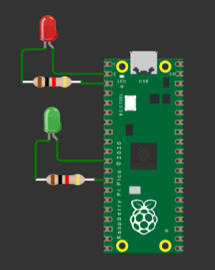
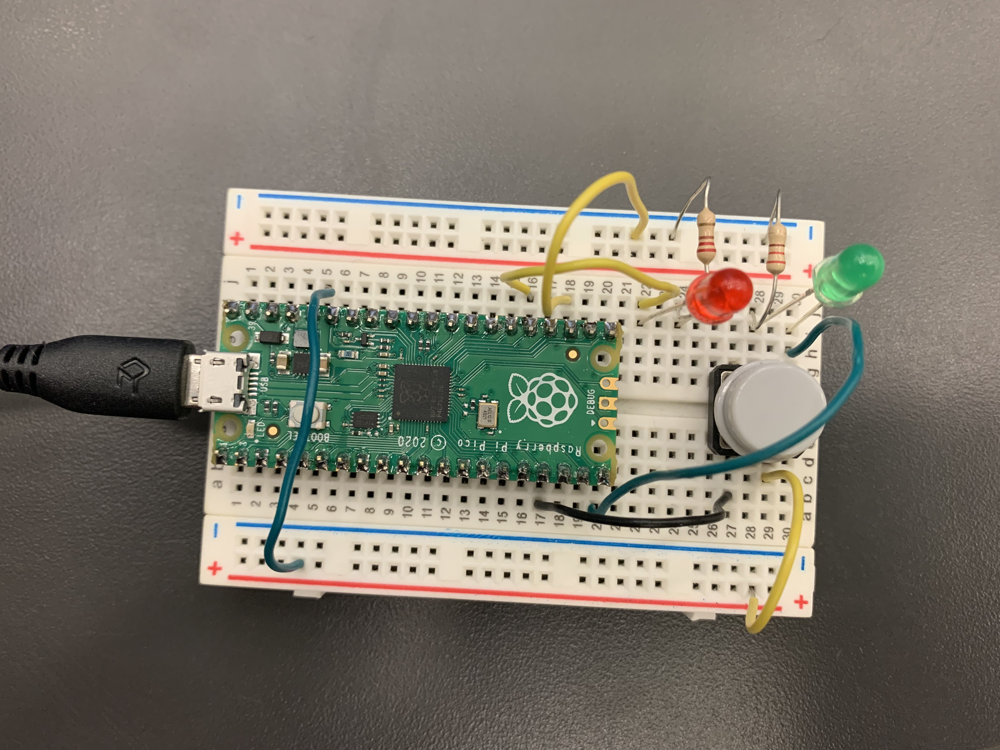
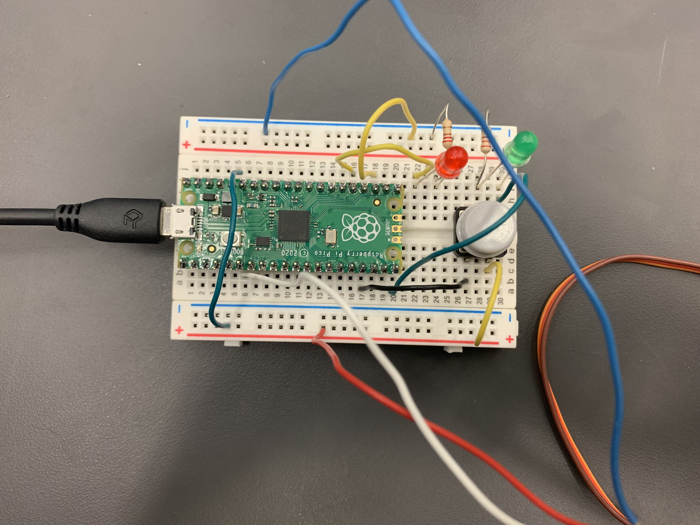
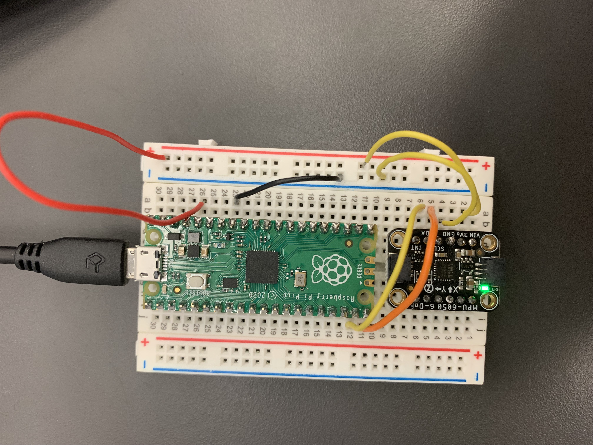
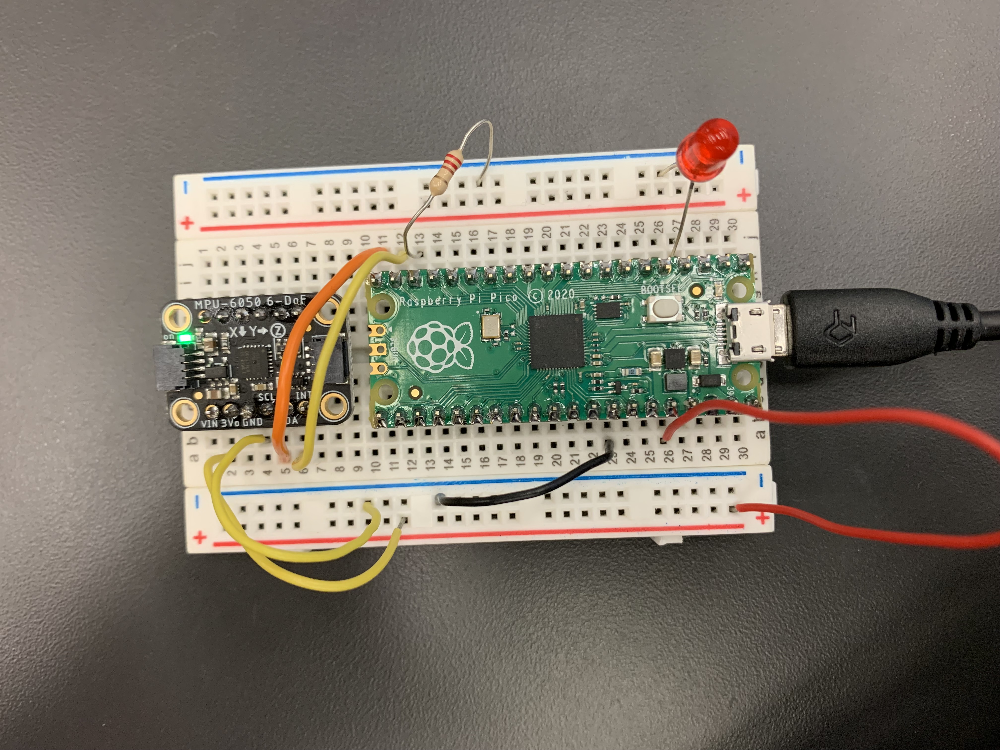
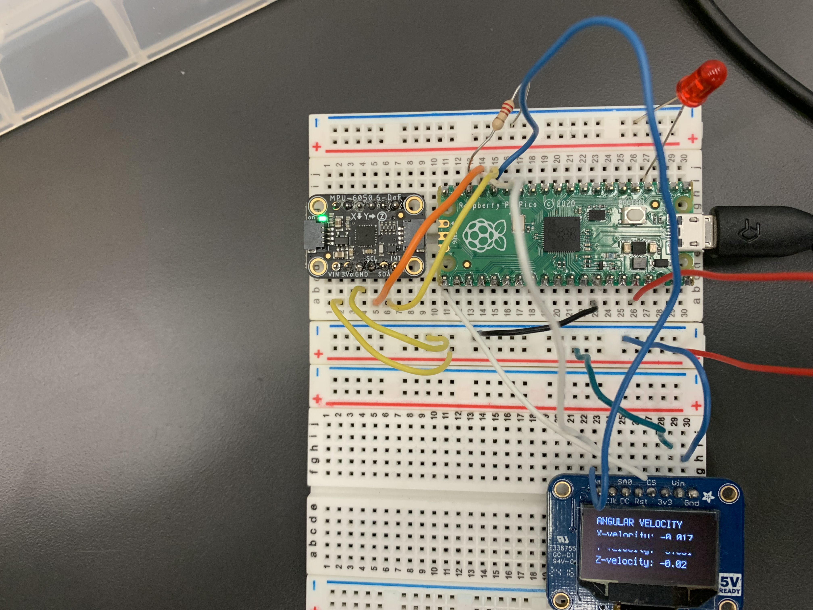

# Engineering_4_Notebook

&nbsp;

## Table of Contents
* [LaunchPad1](#LaunchPad1)
* [LaunchPad2](#LaunchPad2)
* [LaunchPad3](#LaunchPad3)
* [LaunchPad4](#LaunchPad4)
* [CrashAvoidance1](#CrashAvoidance1)
* [CrashAvoidance2](#CrashAvoidance2)
* [CrashAvoidance3](#CrashAvoidance3)
* [LandingArea1](#LandingArea1)
* [LandingArea2](#LandingArea2)
* [MorseCode1](#MorseCode1)
* [Onshape_Assignment_Template](#onshape_assignment_template)

&nbsp;

## LaunchPad1

### Assignment Description

This assignment was to code the serial monitor to count down from 10 to 0, with one second in between. It prints "Liftoff!" after landing.

### Evidence 

 

### Wiring

N.A.

### Code
[Part 1 code](https://github.com/afriedm49/Engineering4_Notebook/blob/main/raspberry-pi/Astronaut1.py)

### Reflection

It was challenging at first to figure out the for loop, but easy once I got it. It important to make sure that your step is negative if you are trying to count down, or else you will need to do print(10-x) for each value of x from 0 to 10.
&nbsp;

## LaunchPad2

### Assignment Description

This assignment was to add on to part 1 by plugging in an external red LED which blinks as time goes down, and a green LED which stays on during liftoff.

### Evidence 

 

### Wiring

 

### Code
[Part 2 code](https://github.com/afriedm49/Engineering4_Notebook/blob/main/raspberry-pi/Astronaut2.py)

### Reflection

Make sure you are using OUTPUT on your LED direction, and get your led to turn on and off within the for loop, so it continually repeats.

&nbsp;

## LaunchPad3

### Assignment Description

This assignment was to add on to parts 1 and 2 by connecting a button that starts the program.

### Evidence 

 

### Wiring

 

### Code
[Part 3 code](https://github.com/afriedm49/Engineering4_Notebook/blob/main/raspberry-pi/Astronaut3.py)

### Reflection

The tricky part on this assignment was making sure that the wiring was set up correct. It was much simpler than I originally thought, because the button only needed to be plugged in to 3V and an input PIN. Pressing the button closes the circuit, signalling a True button.value.

&nbsp;

## LaunchPad4

### Assignment Description

This assignment was to add on to parts 1, 2, and 3 by connecting a servo that spins before liftoff. It starts spinning at 3 seconds remaining, by 60 degrees, and 60 degrees more for seconds 2 and 1, until it's turned all the way 180 degrees.
### Evidence 

 

### Wiring

 

### Code
[Part 4 code](https://github.com/afriedm49/Engineering4_Notebook/blob/main/raspberry-pi/Astronaut4.py)

### Reflection

#### In order to create a "sweeping" effect, it is important to set a counter before the program begins:
```python
counter = 0
```

#### Each second within the for loop, the counter adds one, and sweep begins after 7 seconds:
```python
counter += 1 
if counter > 7: 
    servo1.angle += 60 
```
&nbsp;

## CrashAvoidance1

### Assignment Description

This assignment is to set up the wiring and simple programming of an accelerometer, the mpu6050.

### Evidence 

 

### Wiring

 

### Code
[Crash Avoidance Code Part 1](https://github.com/afriedm49/Engineering4_Notebook/blob/main/raspberry-pi/CrashAvoidance1.py)

### Reflection

The wiring was the trickier part of this assignment. Make sure that the scl pin is connected to an scl applicable pin on the pico, and same with the sda pin. Also, make sure that you have a while loop printing the acceleration, and a time.sleep in place so the values don't run forever. 

As the output is a tuple, you are able to print only the x acceleration, for example, by typing print(mpu.acceleration[0]). Use [1] for y values and [2] for z values.

## CrashAvoidance2

### Assignment Description

This assignment is to make an LED turn on when the accelerometer is sideways.

### Evidence 

 

### Wiring

 

### Code
[Crash Avoidance Code Part 2](https://github.com/afriedm49/Engineering4_Notebook/blob/main/raspberry-pi/CrashAvoidance2.py)

### Reflection

Remember, because the output is a tuple, you are able to print only the x acceleration, for example, by typing print(mpu.acceleration[0]). Use [1] for y values and [2] for z values.
In order to complete this assignment, simply make the led turn on when mpu.acceleration[2] is equal to 0. Because it is hard to line it up exactly sideways, use a margin of error such as one shown below:

```python
while True:
    print(mpu.acceleration)
    if (-1 < mpu.acceleration[2] < 1):
        led.value = True
    else:
        led.value = False
```
&nbsp;

## CrashAvoidance3

### Assignment Description

This assignment is to initiate an LCD screen, printing velocity values of x, y, and z, as well as a title "ANGULAR VELOCITY" at the top of the screen

### Evidence 

 

### Wiring

 

### Code
[Crash Avoidance Code Part 3](https://github.com/afriedm49/Engineering4_Notebook/blob/main/raspberry-pi/CrashAvoidance3.py)

### Reflection

This code was tricky to navigate at first - I had trouble connecting two I2C devices on the same port. I was missing the line:
```python
 mpu = adafruit_mpu6050.MPU6050(i2c, address=your-address-here)
```
After adding this, then tweaking a couple other lines, I was able to turn the LCD screen on.

Now, for the simpler part. Set variables as lines of text you want to print, put that text in the label format setting the position with x= and y=, and then append the label. For example:
```python
 xvelocity = "X-velocity: " + str(round(mpu.gyro[0], 3))
 xlabel = label.Label(terminalio.FONT, text= xvelocity, color=0xFFFF00, x=5 , y=20)
 splash.append(xlabel)
```
Repeat with Y and Z values on subsequent lines, and you're done!
&nbsp;

## LandingArea1

### Assignment Description

This assignment was to design code that requests an input of 3 (x, y) coordinates, and then outputs the area of those points in a triangle.

### Evidence 

 

### Wiring

N.A.

### Code
[LandingArea code part 1](https://github.com/afriedm49/Engineering4_Notebook/blob/main/raspberry-pi/LandingArea1.py)

### Reflection

The main thing needed in order to code this is the split() function. This allows for user input of 2 separate variables within the same input line. Putting a comma in parentheses will be the separater for the input.

&nbsp;

## LandingArea2

### Assignment Description

This assignment was to design code that requests an input of 3 (x, y) coordinates, similarly to part 1, and then outputs the triangle of those points on the OLED screen, with a centerpoint and an x and y axis.

### Evidence 

 

### Wiring


### Code
[LandingArea code part 2](https://github.com/afriedm49/Engineering4_Notebook/blob/main/raspberry-pi/LandingArea2.py)

### Reflection

The adafruit_display_shapes folder is an important piece to this assignment. Importing the line, circle, and triangle shapes gives easy access to these functions. Also, make sure that you convert the inputed floats to integers before printing them on the OLED screen, as the screen is pixels, and cannot receive decimal values.

&nbsp;

## MorseCode1

### Assignment Description

This assignment was to design code that requests an input of a text message, and the code is converted to Morse. If the user inputs -q, then the program ends.

### Evidence 

 

### Wiring


### Code
[MorseCode code part 1](https://github.com/afriedm49/Engineering4_Notebook/blob/main/raspberry-pi/MorseCode1.py)

### Reflection

The dictionary is very helpful in order to have all the morse values in one place, and can be called easily by the MORSE_CODE[], with the letter in the brackets. Use a for loop to go through each letter in the message, and add each morse letter to a blank string, printing it at the end.

&nbsp;
-----------------------------------------------------------------------------------------------------------------------------------------------------------------------
## Onshape_Assignment_Template

### Assignment Description

Write your assignment description here. What is the purpose of this assignment? It should be at least a few sentences.

### Part Link 

[Create a link to your Onshape document](https://cvilleschools.onshape.com/documents/003e413cee57f7ccccaa15c2/w/ea71050bb283bf3bf088c96c/e/c85ae532263d3b551e1795d0?renderMode=0&uiState=62d9b9d7883c4f335ec42021). Don't forget to turn on link sharing in your Onshape document so that others can see it. 

### Part Image

Take a nice screenshot of your Onshape document. 

### Reflection

What went wrong / was challenging, how'd you figure it out, and what did you learn from that experience? Your goal for the reflection is to pass on knowledge that will make this assignment better or easier for the next person. Think about your audience for this one, which may be "future you" (when you realize you need some of this code in three months), me, or your college admission committee!

&nbsp;

## Media Test

Your readme will have various images and gifs on it. Upload a test image and test gif to make sure you've got the process figured out. Pick whatever image and gif you want!

### Test Link
  [Test](raspberry-pi/test.py)      

### Test Image
   
### Test GIF
   
